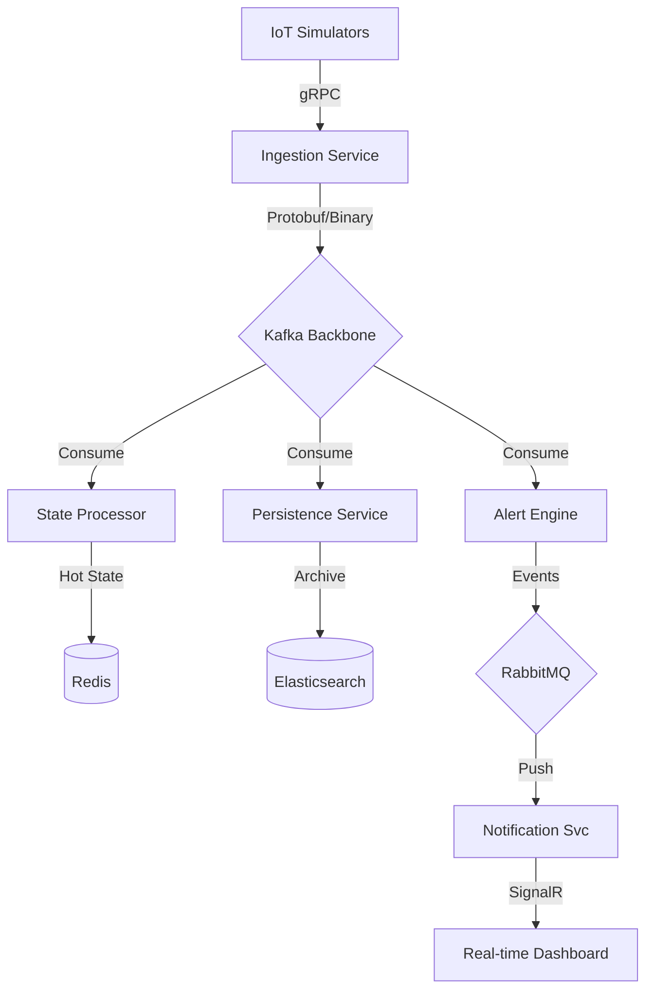
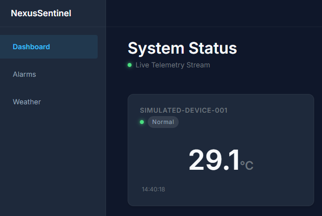
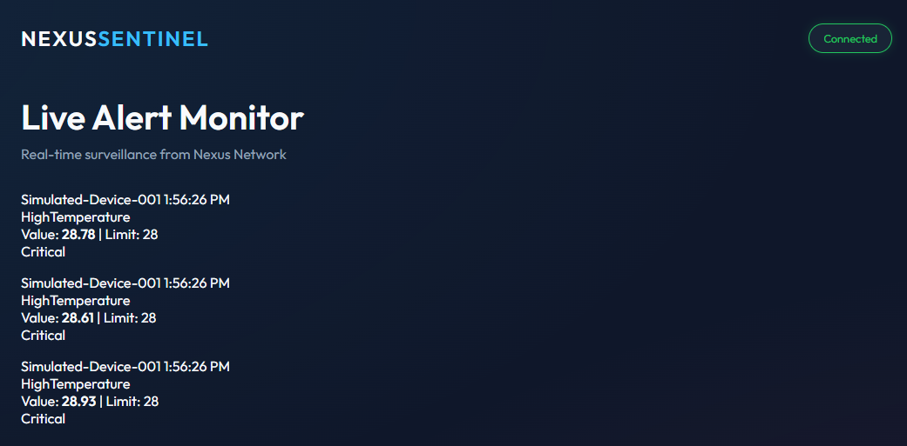
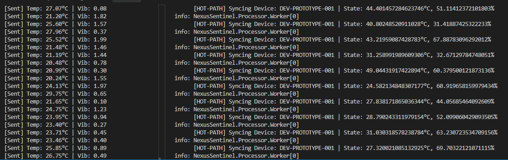
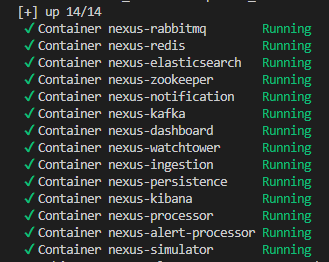

# 🛡️ NexusSentinel

**NexusSentinel** is a high-performance, distributed IoT telemetry and alerting platform built with .NET 9. It demonstrates modern architectural patterns for handling massive data streams, real-time state management, and reliable event-driven notifications.

---

## 🚀 Overview

The project is designed to simulate a real-world industrial monitoring system where thousands of IoT devices stream telemetry (Temperature, Humidity, Vibration) to a central backbone. The system processes "Hot" data for real-time dashboards and archives "Cold" data for long-term analytics, all while triggering critical alerts through a dedicated reliability layer.

## 🏗️ System Architecture

The blueprint of NexusSentinel's distributed event-driven pipeline:



---

## 🖼️ Visual Showcase

### 🖥️ Live Monitoring Interface
The frontend layer consists of a high-level administrative dashboard and a specialized diagnostic tool.

**Main Dashboard (Blazor Server)**

*Real-time orchestration and device state management via SignalR.*

**Watchtower Diagnostic UI (Vanilla JS)**

*Ultra-low latency diagnostic view for system-wide health monitoring.*

### ⚙️ Pipeline & Infrastructure
Inside the engine: high-frequency data ingestion and distributed logging.

**High-Frequency Telemetry Stream**

*The binary Protobuf pipeline in action: IoT Simulators and Processor Service syncing states.*

**Orchestrated Infrastructure**

*Self-healing microservices cluster managed via Docker Compose.*

---

## ✨ Key Features

- **High-Throughput Ingestion:** gRPC server capable of handling multiplexed binary streams.
- **Dual-Bus Messaging:** 
  - **Kafka** for high-volume telemetry buffering and backpressure management.
  - **RabbitMQ** for reliable, routed operational alerts.
- **Microservices Orchestration:** Fully Dockerized ecosystem with optimized multi-stage builds.
- **Advanced Serialization:** System-wide use of **Protobuf** for minimal payload overhead and strict contract enforcement.
- **Polyglot Hybrid UI:** 
  - **Blazor Server** for rich, state-aware administration.
  - **Vanilla JavaScript** for high-performance, low-latency diagnostic "Watchtower" views.
- **Observability:** Centralized logging with Elasticsearch and real-time visualization readiness.

---

## 🛠️ Technology Stack

| Category | Technology |
| :--- | :--- |
| **Framework** | .NET 9 (C#) |
| **Ingestion** | gRPC (Protobuf) |
| **Stream Processing** | Apache Kafka |
| **Messaging** | RabbitMQ |
| **Caching** | Redis (Hot Path) |
| **Persistence** | Elasticsearch (Cold Path) |
| **Real-time UI** | Blazor Server, SignalR (WebSockets) |
| **DevOps** | Docker, Docker Compose |

---

## 🛫 Getting Started

### Prerequisites
- [Docker Desktop](https://www.docker.com/products/docker-desktop/)
- [.NET 9 SDK](https://dotnet.microsoft.com/download/dotnet/9.0) (for local development)

### Quick Start (Docker)
1. Clone the repository.
2. Navigate to the project root.
3. Launch the entire ecosystem:
   ```bash
   docker-compose -f docker/docker-compose.yml up --build
   ```
4. Access the Dashboard at `http://localhost:5003`.
5. Access the Watchtower at `http://localhost:5072`.

---

## 🎓 Engineering Highlights

- **Binary vs JSON:** We transitioned the entire Kafka pipeline from JSON to binary Protobuf, resulting in a **40-60% reduction in network overhead** and significantly faster serialization cycles.
- **Backpressure Handling:** By using Kafka as a shock absorber, the Ingestion Service can acknowledge device requests instantly, regardless of the database's current latency.
- **Service Decoupling:** The Ingestion Service has zero knowledge of the Persistence or Alerting logic, allowing each service to scale horizontally and independently via Kafka Consumer Groups.

---

## 📂 Project Structure

- `/src`: Core microservices and shared libraries.
- `/docs`: Detailed architecture, challenges, and Q&A.
- `/docker`: Orchestration templates and configuration.
- `/tests`: Integration and unit test suites.

---

## 📜 License
Distributed under the MIT License. See `LICENSE` for more information.
