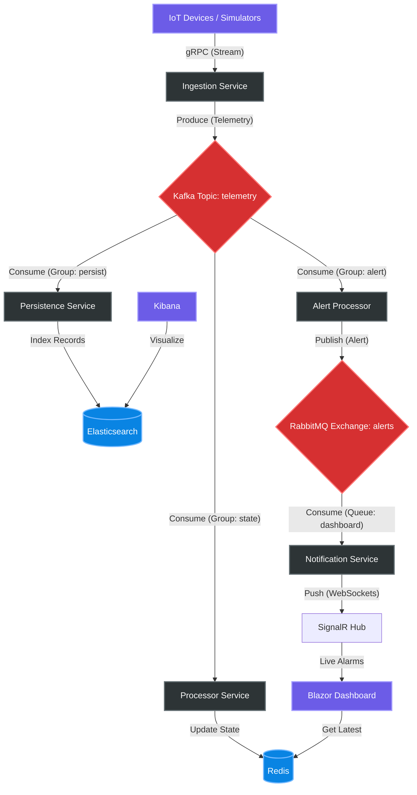

# NexusSentinel - Living Architecture Document

**Status:** Completed Foundations / Maintenance  
**Last Updated:** 2026-02-13

---

## 1. Technical Strategy & Design Patterns

### 1.1 Messaging & Event Streaming
NexusSentinel deliberately distinguishes between **High-Throughput Streaming** and **Reliable Messaging** to implement specialized architectural patterns for different data types.

*   **Kafka (Telemetry Pipeline):**
    *   **Role:** High-velocity data ingestion for millions of IoT telemetry points.
    *   **Philosophy:** Speed and throughput are prioritized. Kafka acts as a persistent log and a shock absorber (Backpressure handling).
    *   **Retention:** Events are stored on disk, allowing for later analysis or system state reconstruction (Event Sourcing light).

*   **RabbitMQ (Operational Alerts):**
    *   **Role:** Routing critical alerts, system commands, and control plane signals.
    *   **Philosophy:** Reliability and complex routing. We use RabbitMQ's exchange/binding system to ensure alerts reach the correct destinations (Dashboard, SMS, Loggers).
    *   **Guarantee:** Supports Acknowledgements (Ack) to ensure no critical message is lost.

### 1.2 Storage Strategy
*   **Redis (Hot Path):** Stores the "Current State" of every device. Provides sub-millisecond access for the Real-time Dashboard.
*   **Elasticsearch (Cold Path / Analytics):** Stores historical telemetry for time-series analysis and long-term logging.
*   **Protobuf Serialization:** Used across the entire pipeline (gRPC, Kafka, RabbitMQ) to ensure minimal payload sizes and strictly typed contracts between services.

---

## 2. System Architecture

### 2.1 Technical Diagram

### 2.2 Component Roles

1.  **Ingestion Service (gRPC Server):**
    *   Accepts high-concurrency gRPC streams from IoT devices.
    *   Validates device identity and forwards Protobuf payloads to the Kafka `telemetry` topic.
    *   *Rationale:* Minimal processing ensures high availability and low latency at the entry point.

2.  **Processor Service (Kafka Consumer):**
    *   Maintains the "Source of Truth" in **Redis**.
    *   Updates the last known temperature, humidity, and status for every device.

3.  **Persistence Service (Kafka Consumer):**
    *   Drives long-term storage by indexing every telemetry event into **Elasticsearch**.
    *   Implements daily index patterns for efficient data lifecycle management.

4.  **Alert Processor (Kafka Consumer / Logic Engine):**
    *   Monitors the telemetry stream for business rule violations (e.g., Temperature > threshold).
    *   Generates `AlertMessage` events and publishes them to **RabbitMQ**.

5.  **Notification Service (RabbitMQ Consumer / SignalR Hub):**
    *   The bridge between the backend event bus and the end-user.
    *   Uses **SignalR** to push alerts directly to browser clients in real-time.

---

## 3. Infrastructure & Deployment

### 3.1 Containerization
The entire solution is Dockerized using **Multi-stage builds**:
- **Build Stage:** Uses .NET SDK images to restore and compile code.
- **Runtime Stage:** Uses lightweight ASP.NET/Runtime images, resulting in production containers as small as 80-100MB.

### 3.2 Orchestration
While currently managed via **Docker Compose** for developer productivity, the architecture is **Ready-for-K8s**:
*   State is externalized (Redis/Elastic).
*   Services are stateless and horizontally scalable (via Kafka Consumer Groups).
*   Communication is host-name based (Service Discovery).

---

## 4. Current Progress

- [x] **Phase 1: Foundation:** Infrastructure setup (Kafka, Redis, RabbitMQ).
- [x] **Phase 2: Ingestion:** gRPC to Kafka flow.
- [x] **Phase 3: State Management:** Redis integration and Device State tracking.
- [x] **Phase 4: Alerting & Notifications:** RabbitMQ and SignalR real-time paths.
- [x] **Phase 5: Persistence:** Elasticsearch integration and daily indexing.
- [ ] **Phase 6: Advanced Analytics:** Implementation of AI-driven anomaly detection.
- [ ] **Phase 7: Cloud Readiness:** Migration to Kubernetes templates (Helm).