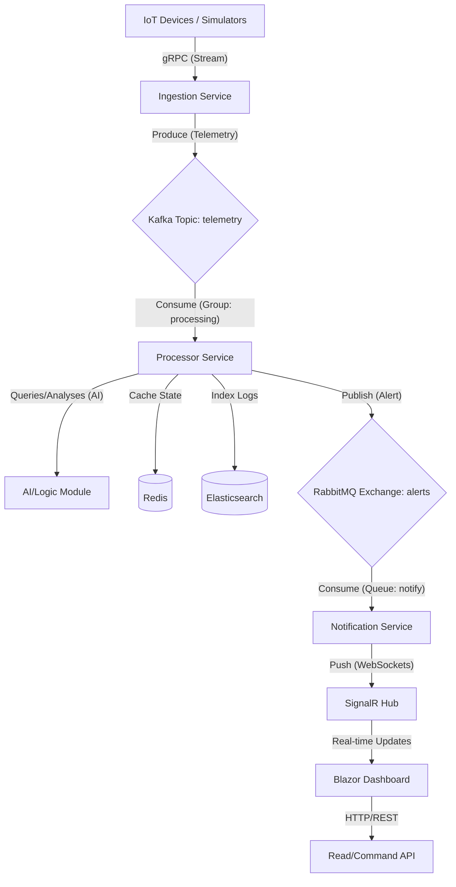

# NexusSentinel - Living Architecture Document

**Status:** Active Development  
**Last Updated:** 2026-02-05

---

## 1. Technical Strategy & Decisions

### 1.1 Messaging & Event Streaming
We deliberately distinguish between High-Throughput streaming and Reliable Messaging to learn both patterns.

*   **Kafka (Telemetry Pipeline):**
    *   **Role:** High-throughput data ingestion for IoT telemetry (Speed > Absolute Reliability).
    *   **Pattern:** Fire-and-forget, Stream Processing.
    *   **Retention:** Logs are kept for replayability/debugging.
*   **RabbitMQ (Operational Events):**
    *   **Role:** Critical Alerts, System Commands, Control Plane (Reliability > Speed).
    *   **Pattern:** Message Queuing, Routing, Confirmation (Ack/Nack).
    *   **Guarantee:** At-least-once delivery is required here.

### 1.2 Future Roadmap (Polyglot & Extensibility)
The architecture is designed to be language-agnostic. We define contracts first.

*   **GoLang Migration:** The "Ingestion Service" is a candidate to be rewritten in Go in the future for raw socket performance.
*   **Frontend Diversity:** While the Admin Dashboard is Blazor, the backend APIs must support future React/Vue portals for end-customers.

---

## 2. High-Level Architecture
## 2. High-Level Architecture

### 2.1 System Diagram

### 2.2 Data Flow Journey

1.  **Ingestion (The Gatekeeper):**
    *   Thousands of IoT devices connect via **gRPC** (for low latency/overhead) to the **Ingestion Service**.
    *   *Why gRPC?* Smaller binaries, strictly typed (Protobuf), and supports multiplexed streaming.
    *   This service does ZERO logic. It validates headers and immediately pushes raw data to **Kafka**.

2.  **Buffering (The Shock Absorber):**
    *   **Kafka** acts as a buffer. If the database is slow or the backend is down, data piles up here safely without crashing the system (Backpressure handling).

3.  **Processing & Intelligence (The Brain):**
    *   **Processor Service** subscribes to Kafka.
    *   It parses the data (e.g., checks Temperature > 100).
    *   **AI Integration:** It runs a lightweight heuristic or calls an AI agent to detect anomalies (e.g., "Vibration pattern suggests imminent motor failure").
    *   **Hot Data:** Updates the latest device state in **Redis** (Key-Value) for instant dashboard access.
    *   **Cold Data:** Archives logs to **Elasticsearch** for history/analytics.

4.  **Critical Alerts (The Fast Lane):**
    *   If the Processor detects a critical anomoly, it publishes an event to **RabbitMQ**.
    *   *Why RabbitMQ here?* We need "Routing" (e.g., Route 'Critical' to SMS, 'Warning' to Dashboard only) and reliability acknowledgements.

5.  **Real-Time Push (The Visibility):**
    *   **Notification Service** listens to RabbitMQ.
    *   It pushes a message to **SignalR Hub**, which instantly notifies connected **Blazor Dashboards**.

---

## 3. Implementation Phases (Rough Plan)

1.  **Phase 1: Foundation:** Solution structure, Docker Compose (Kafka, Redis), and basic "Hello World" connection.
2.  **Phase 2: Ingestion Pipeline:** gRPC Server -> Kafka Producer / Consumer.
3.  **Phase 3: Processing & Storage:** Redis integration, Docker Compose (Elastic), and core logic.
4.  **Phase 4: Critical Path:** RabbitMQ implementation and Notification Service.
5.  **Phase 5: Visualization:** Blazor Dashboard & SignalR.

- **Q** docker-compose.yml dosyasını neden docker dizini altına koyduk?
- **A** Bu tamamen organizasyon ve temizlik tercihi.
    Dizin Temizliği: Proje kök dizini (root) zaten .sln, .gitignore, README gibi dosyalarla kalabalık. Altyapı (Docker, Terraform, Scripts vb.) dosyalarını kendi klasöründe toplamak daha profesyonel bir yaklaşımdır.
    Genişleme: İleride sadece tek bir Compose değil; docker-compose.prod.yml, docker-compose.test.yml gibi dosyalar eklediğinde hepsi derli toplu tek bir yerde durur.

- **Q** Mimarideki zookeeper katmanı nedir ve görevi nedir?
- **A** 